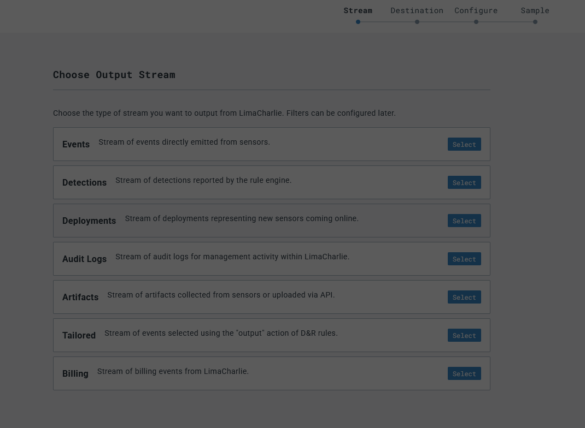
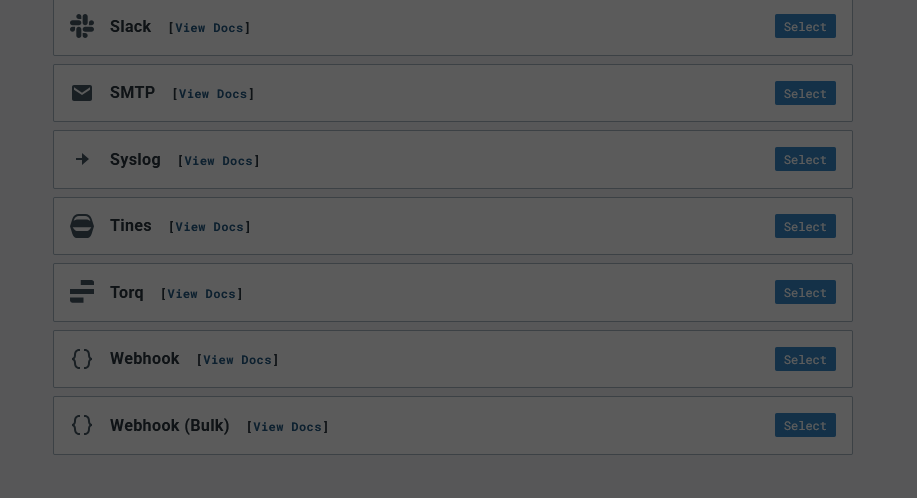
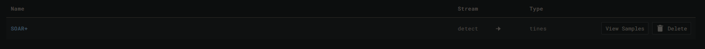

# SOAR-EDR: Automating Threat Detection & Response

## Table of Contents

- [Introduction](#introduction)
- [Workflow](#workflow)
- [Project Setup](#project-setup)
- [Conclusion](#conclusion)

---

## Introduction

The **SOAR-EDR** project provides hands-on experience with integrating Security Orchestration, Automation, and Response (SOAR) with Endpoint Detection and Response (EDR) systems. This is achieved by combining **LimaCharlie** and **Tines**.

-  is a cloud-based platform offering Security Operations (SecOps) tools such as EDR, log collection, automation, and custom threat detection capabilities.
-  is a SOAR platform designed to automate security workflows without the need for coding.

The goal of this project is to create an automated detection and response workflow that:
1. Detects threats
2. Sends alerts via Slack and email
3. Provides an option to isolate compromised machines

## Workflow
### 1. Threat Detection
   - Lima Charlie detects suspicious activity.
   - The detected event is forwarded to Tines for further processing.
### 2. Alert
   - Tines sends an alert to Slack and email, containing:  `Timestamp` `Computer Name` `Source IP` `Process Command Line` `File Path` `Sensor ID` `Detection Link (if application)`
### 3. User Decision & Response
   - The user will be prompted to either isolate the machine or not.
        - If **yes**, LimaCharlie will automatically isolate the machine.
        - If **no**, an alert will be sent to Slack.
### 4. Status Update
   - If isolation is successful/unsuccessful, a status update will be sent to Slack. Here's the workflow diagram:  

     

## Project-Setup
### Windows Server Setup

- For this project, you need a Windows Server instance, which can either be hosted on a local machine or a cloud provider. 
- A **Windows Server 2025** VM instance is recommended, but previous versions will also work.
  
### LimaCharlie Configuration
1. **Account Creation**: 
   - Sign up for a **LimaCharlie** account.
   - Once logged in, create an <b>Organization</b> and select a <b>Data Residency Region</b>. 

 
2. **Generate Installation Key**: 
   - Navigate to **Sensors > Installation Keys** to generate an installation key. You can name it as you see fit. 

 
3. **Sensor Installation**: 
   - Once you've logged into LimaCharlie, you should see something like this: 

 
   - Before moving on, let's explore what LimaCharlie has to offer. On the right-hand side, you have options such as `Detections`, `Automation`, etc. 

 
   - By now, you should have generated an <b>Installation Key</b>. When you scroll below on the <b>Installation Keys</b> page, you should see a list of sensor downloads for various operating systems. We're interested in an EDR sensor for Windows 64-bit, or to your respective version. <b>NOTE:</b>Make sure to copy the link of your respective EDR-sensor download and paste that into your Windows Server browser, which will download the actual agent. 

 
4. **Run Installation Command**:
   - Once you've downloaded the agent onto your Windows Server, run the following command:  `cd Downloads` `.\(file name).exe -i (YOUR_INSTALLATION_KEY)` 
   - Verify the agent is running in <b>LimaCharlie > Sensors List</b>. Here's my sensor (middle one): 

 
   - When you click on the sensor, you'll be brought to a page that lists information about the sensor, such as hostname, platform, etc. On the left, you'll see a list of features. 

 .
   - From this point, we'll start testing out certain features that LimaCharlie is known for, such as detecting suspicious activities based on given rules and performing automation to deal with threats.

### Testing LimaCharlie's Features
1. **Detecting Suspicious Activity**: 
   - Download  (a tool used for password recovery) on your server. We'll be using this tool to test LimaCharlie. Use the following command to run it. `.\lazagne.exe all` 
   - LimaCharlie will detect LaZagne's execution.
2. **Creating Detection & Response (D&R) Rule**:
   - Now we're going to create a <b>Detection & Response Rule</b>, which can be done by going to <b>LimaCharlie > Automation > D&R Rules</b>. 

 
   - Copy and paste the text from  on to the respective sections. 

 
3. **Testing the Rule**:
   - To test the rule, simply scroll down and click `Target Event`. Here, we'll simply paste an event, which we will now find. 

 
   - To find the event, make sure you've run LaZagne, as that'll generate an event in LimaCharlie. To find it, head to <b>Sensor > Timelime</b>. It'll look like this: 

 
   - Searching for LaZagne will give us this: 

 
   - Click on any of the events that mention <b>NEW_PROCESS</b> and copy that event. Head back to `Target Event` to test our rule. Once you paste it in and click `Test Event`, it'll show this: 

 
   - This indicates that our rule works without any errors. Make sure to save the rule. At this point, LimaCharlie will be able to detect any events that trigger our rule and it'll display that in the `Detections` tab. Here's what it'll look like if you run LaZagne again: 

 
6. **View Detections**: 
   - After triggering the event, you can view detection details, such as:
     - Hash
     - Process ID
     - Additional metadata that will assist in investigating malicious activity.
7. **Automated Actions**: 
   - Based on the detected events, you can configure LimaCharlie to perform automated actions, such as isolating the machine.

### Slack and Tines
1. Create an account on Slack and Tines. Make sure to create a channel called `#alerts` on Slack.
2. On LimaCharlie, head into `Outputs > Add Output > Detections > Tines > Enter a name and paste in the Destination Host URL, which you can easily get by configuring Tines. Make sure to save the output. 

 

 
4. Now we're going to test by simply running LaZagne again. Back on the Outputs page, you should see something like this: 

 
5. 
                                                                                    

## Conclusion

