# SOAR-EDR: Automating Threat Detection & Response

## Table of Contents
1. [Introduction](#introduction)
2. [Workflow](#workflow)
3. [Project Setup](#project-setup)
4. [Conclusion](#conclusion)

## Introduction
This project provides hands-on experience with Security Orchestration, Automation, and Response (SOAR) and Endpoint Detection and Response (EDR) by integrating Lima Charlie and Tines. [LimaCharlie](https://limacharlie.io/) is a Security Operations (SecOps) Cloud Platform that provides Endpoint Detection and Response (EDR), log collection, automation, and custom threat detection capabilities. [Tines](https://www.tines.com/) is a Security Orchestration, Automation, and Response (SOAR) platform that allows security teams to automate workflows without writing code. The goal is to create a detection and response workflow that can automatically identify threats, send alerts via Slack and email, and provide an option to isolate compromised machines.

## Workflow
### 1. Threat Detection
   - Lima Charlie detects suspicious activity.
   - Detection is forwarded to Tines for further processing.
### 2. Alert
   - Tines sends an alert to Slack and email, containing:  `Timestamp` `Computer Name` `Source IP` `Process Command Line` `File Path` `Sensor ID` `Detection Link (if application)`
### 3. User Decision & Response
   - The user will be prompted to either isolate the machine or not. If yes, LimaCharlie will automatically isolate the machine. If no, an alert will be sent to Slack.
### 4. Status Update
   - If isolation is successful/unsuccessful, Slack will receive the respective status update. Here's the workflow diagram:  

     

## Project-Setup
- Windows Server:
   - For this lab, a Windows Server is necessary, as that's where our data will come from. I created a VM instance of the Windows Server 2025 version, though past versions should work just fine. Do note that you could also create a VM on the cloud using a cloud provider. 
- LimaCharlie:
   - Once you have configured the Windows Server, you'd need to create an account on LimaCharlie. After creating an account, head over to <b>Organization</b> and select a <b>Data Residency Region</b>. 

 
   - Don't forget to generate an <b>installation key</b> under <b>Sensors > Installation Keys</b>. Feel free to name it whatever. 

 
- Post-LimaCharlie:
   - Once you've logged into LimaCharlie, you should see something like this: 
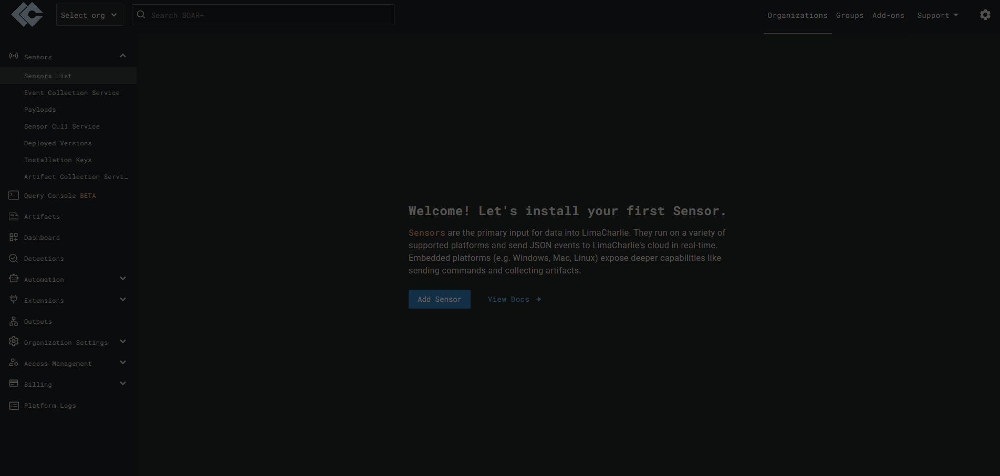
 
   - Before moving on, let's explore what LimaCharlie has to offer. On the right-hand side, you have options such as `Detections`, `Automation`, etc. 
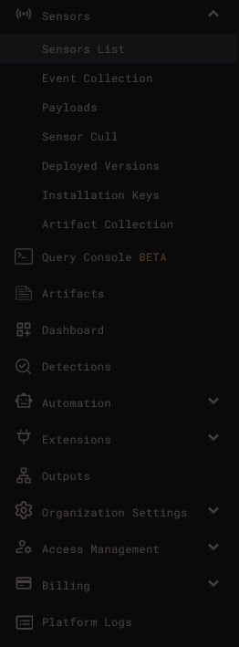
 
   - By now, you should have generated an <b>Installation Key</b>. When you scroll below on the <b>Installation Keys</b> page, you should see a list of sensor downloads for various operating systems. We're interested in an EDR sensor for Windows 64-bit, or to your respective version. <b>NOTE:</b>Make sure to copy the link of your respective EDR-sensor download and paste that in your Windows Server browser, which will download the actual agent. 
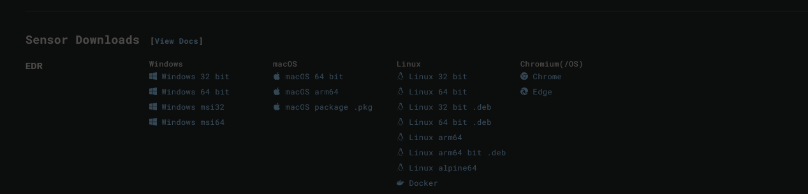
 
   - Once you've downloaded the agent onto your Windows Server, run the following command:  `cd Downloads` `.\(file name).exe -i (YOUR_INSTALLATION_KEY)` 
   - Verify the agent is running in <b>LimaCharlie > Sensors List</b>. Here's my sensor (middle one): 
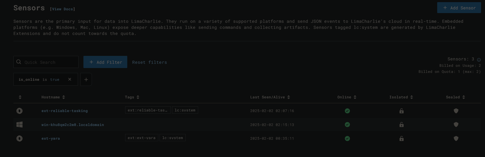
 
   - When you click on the sensor, you'll be brought to a page where it lists information about the sensor, such as Hostname, Platform, etc. On the left, you'll see a list of features. 
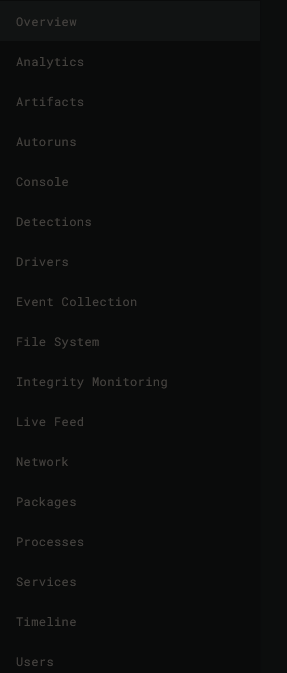
 .
   - From this point, we'll start testing out certain features that LimaCharlie is known for, such as detecting suspicious activities based on given rules and performing automation to deal with threats.
   - Download  on your server. We'll be using this tool to test LimaCharlie.
   - After downloading LaZagne, run it using the following command: `.\lazagne.exe all` 
   - LimaCharlie will now detect the execution of LaZagne.
   - Now we're going to create a <b>Detection & Response Rule</b>, which can be done by going to <b>LimaCharlie > Automation > D&R Rules</b>. 
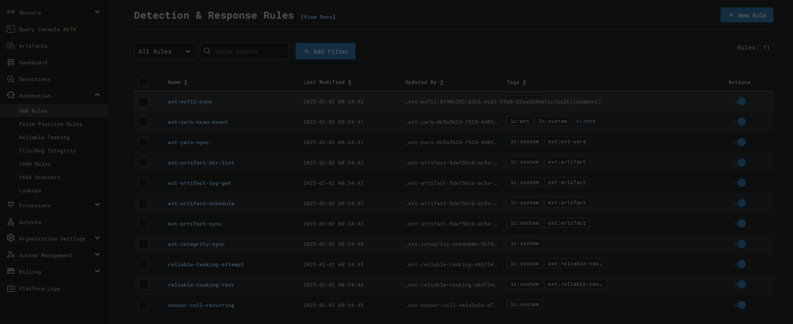
 
   - Copy and paste the text from  on to the respective sections. 
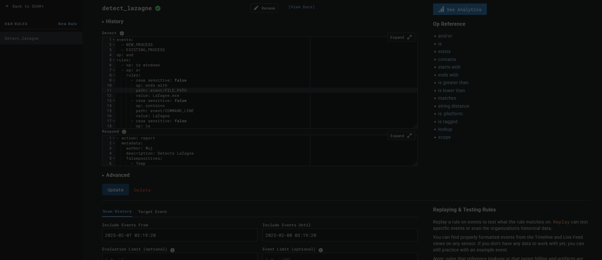
 
   - To test the rule, simply scroll down and click `Target Event`. Here, we'll simply paste an event, which we will now find. 
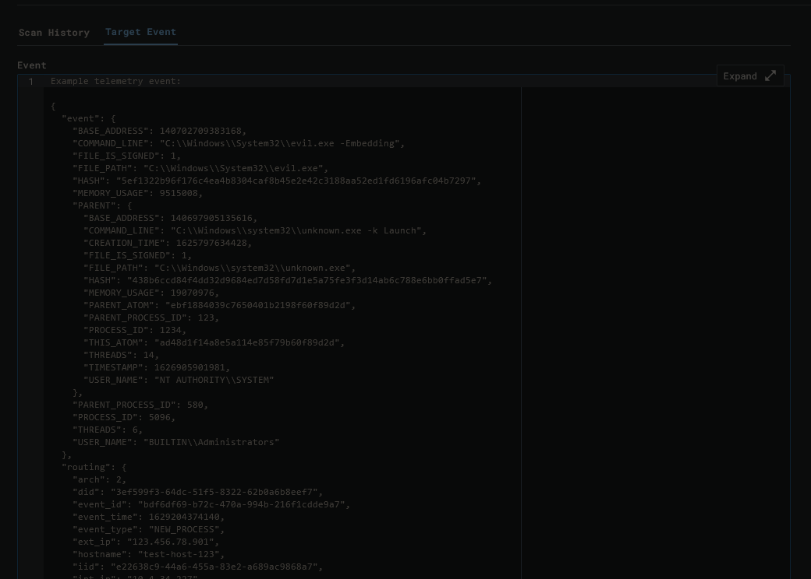
 
   - To find the event, make sure you've run LaZagne, as that'll generate an event in LimaCharlie. To find it, head to <b>Sensor > Timelime</b>. It'll look like this: 
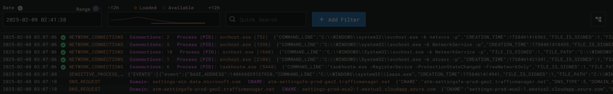
 
   - Searching for LaZagne will give us this: 
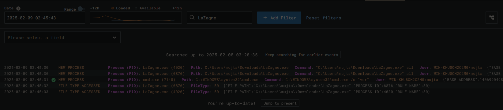
 
   - Click on any of the events that mention <b>NEW_PROCESS</b> and copy that event. Head back to `Target Event` to test our rule. Once you paste it in and click `Test Event`, it'll show this: 
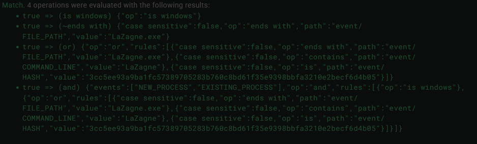
 
   - This indicates that our rule works without any errors. Make sure to save the rule. At this point, LimaCharlie will be able to detect any events that trigger our rule and it'll display that in the `Detections` tab. Here's what it'll look like if you run LaZagne again: 
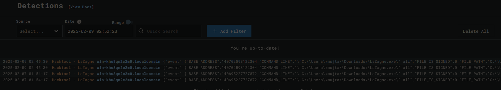
 
   - Clicking on one of the detections will give you a bunch of information such as the `Hash, PROCESS_ID, and more`. With this information, we could perform investigations regarding any malicious activity on our systems, as well as perform automated actions based on such activity.

                                                                                    

## Conclusion

